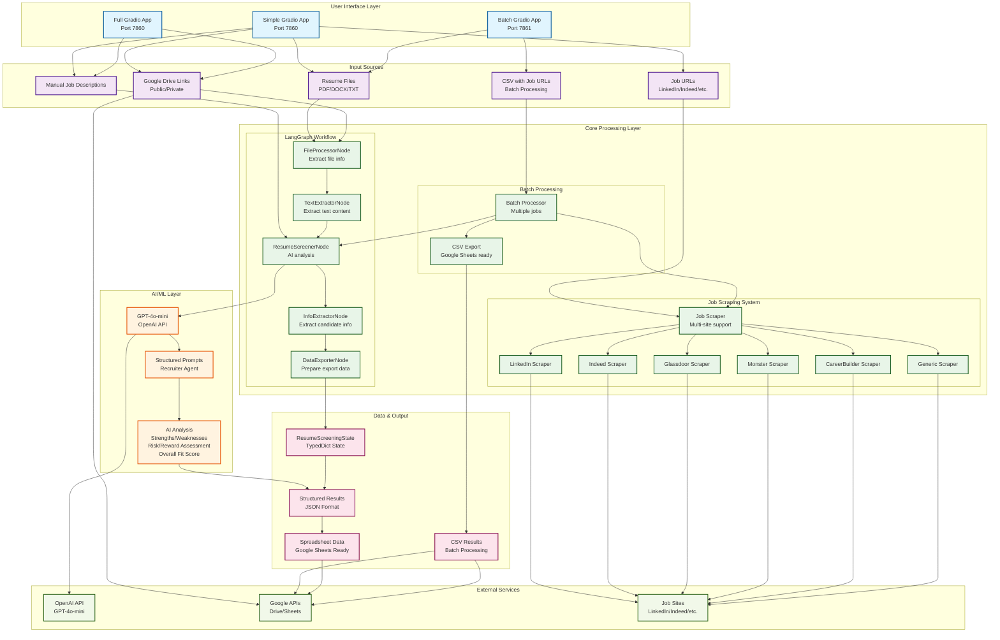
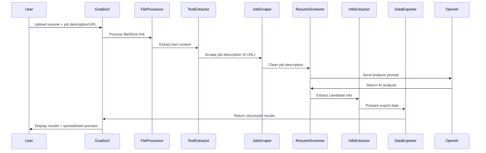
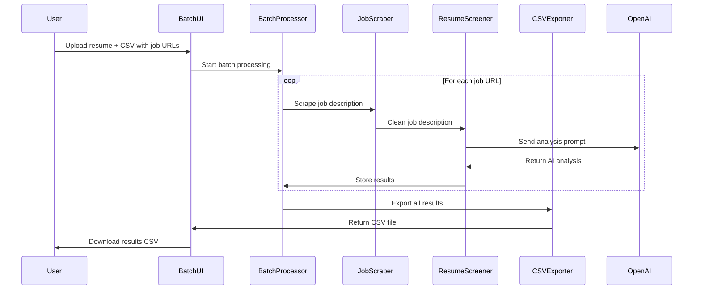

# Resume Screening System Architecture

## 🏗️ System Overview

The Resume Screening System is an AI-powered application that analyzes resumes against job descriptions using LangGraph workflows, web scraping, and GPT-4o-mini for intelligent assessment. The system supports both single resume analysis and batch processing against multiple job postings.

## 📊 Architecture Diagram



## 🔄 Data Flow

### 1. Single Resume Screening Flow



### 2. Batch Processing Flow



## 🧩 Component Details

### 1. User Interface Components

#### Simple Gradio App (`simple_gladio_app.py`)
- **Port**: 7860
- **Features**: 
  - Direct file upload (PDF/DOCX/TXT)
  - Public Google Drive links
  - Job URL scraping
  - Manual job description input
  - Real-time results display
  - Spreadsheet export preview

#### Batch Gradio App (`batch_gladio_app.py`)
- **Port**: 7861
- **Features**:
  - Single resume upload
  - CSV template download
  - Batch job URL processing
  - Progress tracking
  - CSV results export

#### Full Gradio App (`gladio_app.py`)
- **Port**: 7860
- **Features**:
  - Google Cloud integration
  - Private Google Drive access
  - Advanced authentication

### 2. Core Processing Components

#### LangGraph Workflow (`simple_resume_screener.py`)
```python
class ResumeScreeningState(TypedDict):
    # Input
    file_content: Optional[bytes]
    file_name: Optional[str]
    file_type: Optional[str]
    drive_link: Optional[str]
    job_description: str
    job_url: Optional[str]
    
    # Processing
    resume_text: Optional[str]
    
    # AI Analysis
    screening_results: Optional[Dict[str, Any]]
    candidate_info: Optional[Dict[str, str]]
    
    # Output
    spreadsheet_data: Optional[Dict[str, Any]]
    error: Optional[str]
```

**Workflow Nodes:**
1. **FileProcessorNode**: Handles file uploads and Google Drive links
2. **TextExtractorNode**: Extracts text from PDF/DOCX/TXT files
3. **ResumeScreenerNode**: AI-powered resume analysis
4. **InfoExtractorNode**: Extracts candidate information
5. **DataExporterNode**: Prepares data for spreadsheet export

#### Job Scraping System (`job_scraper.py`)
**Supported Sites:**
- LinkedIn (with enhanced scraping)
- Indeed
- Glassdoor
- Monster
- CareerBuilder
- Generic sites

**Features:**
- Retry logic with exponential backoff
- Multiple CSS selector fallbacks
- Content cleaning and validation
- Company name extraction
- Error handling and logging

### 3. AI/ML Components

#### GPT-4o-mini Integration
- **Model**: GPT-4o-mini
- **Temperature**: 0.1 (consistent results)
- **Prompts**: Structured recruiter agent prompts
- **Output**: JSON-formatted analysis

#### Analysis Components
- **Strengths Analysis**: Identifies candidate strengths
- **Weaknesses Analysis**: Identifies areas of concern
- **Risk Assessment**: Low/Medium/High risk evaluation
- **Reward Assessment**: Low/Medium/High reward potential
- **Overall Fit Score**: 0-10 rating with justification

### 4. Data Processing Components

#### Text Extraction
- **PDF**: PyPDF2 for text extraction
- **DOCX**: python-docx for Word documents
- **TXT**: Direct text reading
- **Google Drive**: API-based file download

#### Content Cleaning
- **Job Descriptions**: Remove UI elements, clean formatting
- **Resume Text**: Extract relevant information
- **Company Names**: Parse and validate

## 🔧 Technical Stack

### Core Technologies
- **Python 3.9+**: Main programming language
- **LangGraph**: Workflow orchestration
- **LangChain**: AI/ML framework
- **Gradio**: Web interface framework
- **OpenAI GPT-4o-mini**: AI analysis engine

### Dependencies
- **File Processing**: PyPDF2, python-docx
- **Web Scraping**: requests, beautifulsoup4, lxml
- **Data Handling**: pandas, pydantic
- **Google APIs**: google-api-python-client
- **Environment**: python-dotenv

### Package Management
- **uv**: Fast Python package manager
- **pyproject.toml**: Modern Python packaging
- **uv.lock**: Dependency locking

## 🚀 Deployment Architecture

### Development Setup
```bash
# Install dependencies
uv sync

# Set environment variables
echo "OPENAI_API_KEY=your-key" > .env

# Run simple interface
uv run python simple_gladio_app.py

# Run batch interface
uv run python batch_gladio_app.py
```

### Production Considerations
- **API Rate Limiting**: Built-in delays between requests
- **Error Handling**: Comprehensive error catching and reporting
- **File Management**: Proper file handle cleanup
- **Memory Management**: Efficient state management
- **Scalability**: Stateless workflow design

## 📈 Performance Characteristics

### Processing Times
- **Single Resume**: ~2-3 seconds
- **Job Scraping**: ~1-2 seconds per job
- **AI Analysis**: ~1-2 seconds per analysis
- **Batch Processing**: ~2-3 seconds per job (with delays)

### Resource Usage
- **Memory**: Low (stateless processing)
- **CPU**: Moderate (AI processing)
- **Network**: Moderate (API calls and scraping)
- **Storage**: Minimal (temporary file processing)

### Scalability
- **Concurrent Users**: Limited by OpenAI API rate limits
- **Batch Size**: Recommended max 50 jobs per batch
- **File Size**: Limited by memory (typically <10MB)

## 🔒 Security & Privacy

### Data Handling
- **File Processing**: Temporary storage only
- **API Keys**: Environment variable storage
- **Google Drive**: Public links or OAuth2 authentication
- **Job Scraping**: Respectful rate limiting

### Privacy Considerations
- **Resume Data**: Processed in memory, not stored
- **Job Data**: Scraped content not persisted
- **Analysis Results**: User-controlled export
- **API Calls**: Secure HTTPS communication

## 🛠️ Configuration

### Environment Variables
```bash
OPENAI_API_KEY=your-openai-api-key
GOOGLE_APPLICATION_CREDENTIALS=path/to/credentials.json
```

### Google Drive Setup (Optional)
1. Create Google Cloud Project
2. Enable Drive and Sheets APIs
3. Create OAuth2 credentials
4. Download credentials.json

### File Permissions
- **Resume Files**: Read-only access
- **CSV Files**: Read/write for batch processing
- **Output Files**: Write access for results

This architecture provides a robust, scalable, and user-friendly resume screening system that can handle both individual and batch processing scenarios while maintaining high performance and reliability. 